# CSA Coursework: Game of Life

**[Video Walkthrough of Parallel Component (skip to 04:20 to skip IntelliJ install and project opening steps)](https://web.microsoftstream.com/video/990e039f-4bc1-4b22-b0b1-ae895ee07163)** Please note that the rest of assignment will be introduced after reading week

<!-- **[Coursework Q&A Recording](https://web.microsoftstream.com/video/ab833321-3a78-4c83-b87e-16ce1b5c244f)** -->

This is the Computer Systems A summative coursework. The coursework is worth 80% of the unit mark. It is to be completed in your programming pairs. You must report any change to your pairing to the unit director *before* starting your assignment. It runs over 4 weeks (5 weeks including the reading week) and the deadline for submitting all your work is **Friday 3rd December 13:00**.

Talk to each other regularly and make sure you manage your team well. Let us know about issues before they grow to affect your team’s performance. It is important to carefully manage your time for this assignment. Do not spend hours trying to debug on your own; use pair programming, seek help from our teaching assistants during scheduled labs and ask questions on Teams.

**Do not plagiarise.** Both team members should understand all code developed in detail. 

## Task Overview

### Introduction

The British mathematician John Horton Conway devised a cellular automaton named ‘The Game of Life’. The game resides on a 2-valued 2D matrix, i.e. a binary image, where the cells can either be ‘alive’ (pixel value 255 - white) or ‘dead’ (pixel value 0 - black). The game evolution is determined by its initial state and requires no further input. Every cell interacts with its eight neighbour pixels: cells that are horizontally, vertically, or diagonally adjacent. At each matrix update in time the following transitions may occur to create the next evolution of the domain:

- any live cell with fewer than two live neighbours dies
- any live cell with two or three live neighbours is unaffected
- any live cell with more than three live neighbours dies
- any dead cell with exactly three live neighbours becomes alive

Consider the image to be on a closed domain (pixels on the top row are connected to pixels at the bottom row, pixels on the right are connected to pixels on the left and vice versa). A user can only interact with the Game of Life by creating an initial configuration and observing how it evolves. Note that evolving such complex, deterministic systems is an important application of scientific computing, often making use of parallel architectures and concurrent programs running on large computing farms.

Your task is to design and implement programs which simulate the Game of Life on an image matrix.

### Skeleton Code

To help you along, you are given a simple skeleton project. The skeleton includes tests and an SDL-based visualiser. All parts of the skeleton are commented. All the code has been written in Go. You will not be required to write any C code. If you have any questions about the skeleton please ask a TA for help.

You **must not** modify any of the files ending in `_test.go`. We will be using these tests to judge the correctness of your implementation.

The skeleton code uses SDL. This is a basic graphics library which you already used in Imperative Programming unit. To install the library follow the following instructions:

- **Linux Lab Machines** - SDL should already be installed and working.
- **Personal Ubuntu PCs** - `sudo apt install libsdl2-dev`
- **MacOS** - `brew install sdl2` or use the official [`.dmg` installer](https://www.libsdl.org/download-2.0.php).
- **Other** - Consult the [official documentation](https://wiki.libsdl.org/Installation) or see our [experimental instructions for running natively on Windows](content/windows_sdl_native.md)

### Submission

The coursework requires two independent implementations. You will be required to submit **both** implementations (assuming both were attempted). Every student is required to upload their full work to Blackboard. There will be three separate submissions points on Blackboard - one for the report and two for each implementation.

- For the report, you must submit a single file called `report.pdf`.
- For the parallel implementation, you must submit a single zip file called `parallel.zip`. It must contain all the code required to compile and run the program.
- For the distributed implementation, you must submit a single zip file called `distributed.zip`. It must contain all the code required to compile and run the program.

Submitting different filenames or file formats (e.g. `.docx`, `.tex`, `.7z` or `.rar`) will result in a mark penalty.

You should be using `git` for version control, however, please don't include your `.git` directory in your submission. You can generate a correct archive using the command `git archive -o [FILENAME].zip HEAD`. 

Make sure you submit it early (not last minute!) to avoid upload problems. **Each team member has to upload an identical copy of the team's work.**

## Stage 1 - Parallel Implementation

In this stage, you are required to write code to evolve Game of Life using multiple worker goroutines on a single machine. Below are some suggested steps to help you get started. You are *not* required to follow them. Your implementation will be marked against the success criteria outlined below.

### Step 1

Implement the Game of Life logic as it was described in the task introduction. We suggest starting with a single-threaded implementation that will serve as a starting point in subsequent steps. Your Game of Life should evolve for the number of turns specified in `gol.Params.Turns`. Your Game of Life should evolve the correct image specified by  `gol.Params.ImageWidth` and `gol.Params.ImageHeight`.

The skeleton code starts three goroutines. The diagram below shows how they should interact with each other. Note that not all channels linking IO and the Distributor have been initialised for you. You will need to make them and add them to the `distributorChannels` and `ioChannels` structs. These structs are created in `gol/gol.go`.

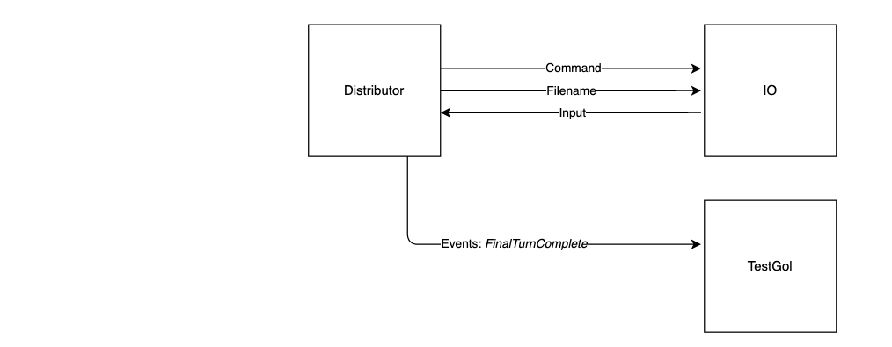

You are not able to call methods directly on the IO goroutine. To use the IO, you will need to utilise channel communication. For reading in the initial PGM image, you will need the `command`, `filename` and `input` channels. Look at the file `gol/io.go` for details. The functions `io.readPgmImage` and `startIo` are particularly important in this step.

Your Game of Life code will interact with the user or the unit tests using the `events` channel. All events are defined in the file `gol/event.go`. In this step, you will only be working with the unit test `TestGol`. Therefore, you only need to send the `FinalTurnComplete` event.

Test your serial, single-threaded code using `go test -v -run=TestGol/-1$`. All the tests ran should pass.

### Step 2

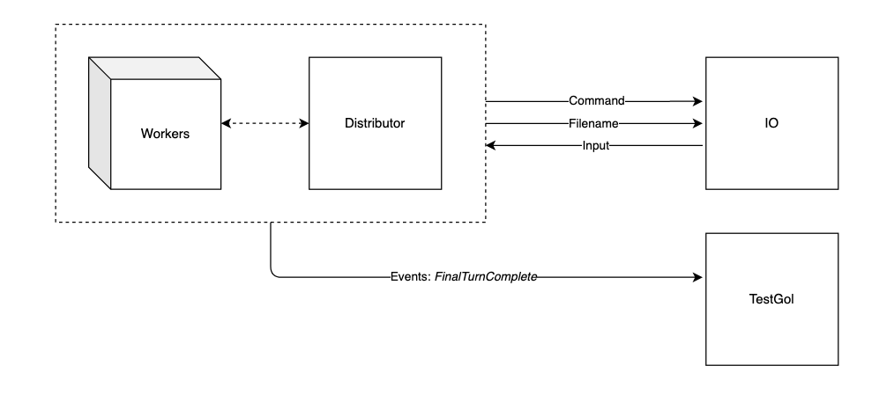

Parallelise your Game of Life so that it uses worker threads to calculate the new state of the board. You should implement a distributor that tasks different worker threads to operate on different parts of the image in parallel. The number of worker threads you should create is specified in `gol.Params.Threads`.

*Note: You are free to design your system as you see fit, however, we encourage you to primarily use channels*

Test your code using `go test -v -run=TestGol`. You can use tracing to verify the correct number of workers was used this time.

### Step 3

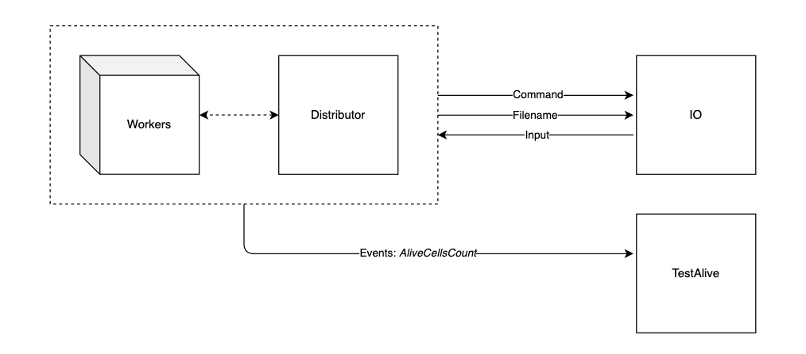

The lab sheets included the use of a timer. Now using a ticker, report the number of cells that are still alive *every 2 seconds*. To report the count use the `AliveCellsCount` event.

Test your code using `go test -v -run=TestAlive`.

### Step 4

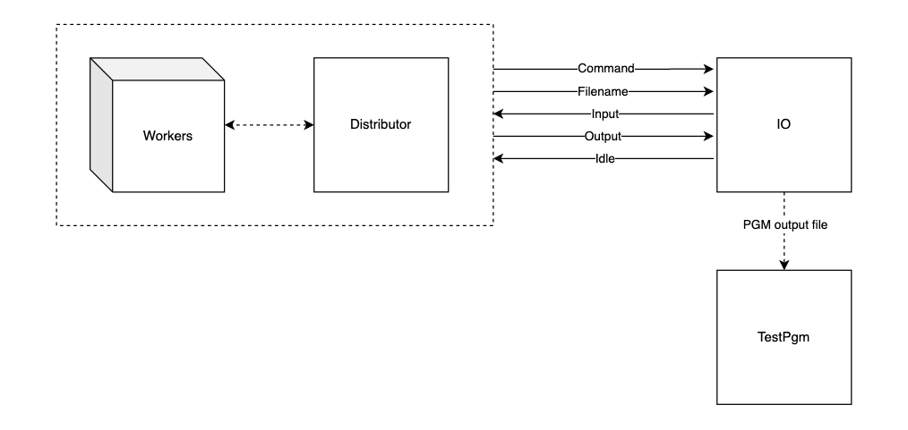

Implement logic to output the state of the board after all turns have completed as a PGM image.

Test your code using `go test -v -run=TestPgm`. Finally, run `go test -v` and make sure all tests are passing.

### Step 5

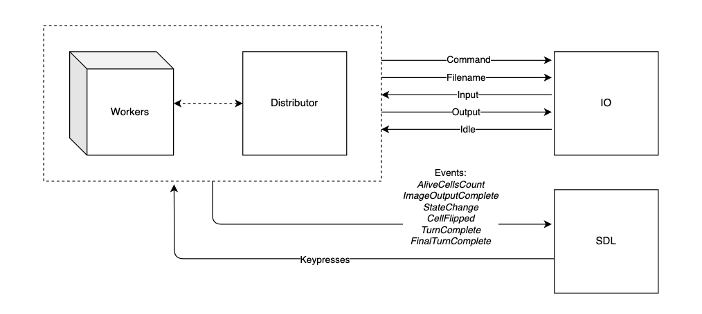

Implement logic to visualise the state of the game using SDL. You will need to use `CellFlipped` and `TurnComplete` events to achieve this. Look at `sdl/loop.go` for details. Don't forget to send a CellFlipped event for all initially alive cells before processing any turns.

Also, implement the following control rules. Note that the goroutine running SDL provides you with a channel containing the relevant keypresses.

- If `s` is pressed, generate a PGM file with the current state of the board.
- If `q` is pressed, generate a PGM file with the current state of the board and then terminate the program. Your program should *not* continue to execute all turns set in `gol.Params.Turns`.
- If `p` is pressed, pause the processing and print the current turn that is being processed. If `p` is pressed again resume the processing and print `"Continuing"`. It is *not* necessary for `q` and `s` to work while the execution is paused.

Test the visualisation and control rules by running `go run .`

### Success Criteria

- Pass all test cases under `TestGol`, `TestAlive` and `TestPgm`.
- Use the correct number of workers as requested in `gol.Params`.
- Display the live progress of the game using SDL.
- Ensure that all keyboard control rules work correctly.
- Use benchmarks to measure the performance of your parallel program.
- The implementation must scale well with the number of worker threads.
- The implementation must be free of deadlocks and race conditions.

### In your Report

- Discuss the goroutines you used and how they work together.
- Explain and analyse the benchmark results obtained. You may want to consider using graphs to visualise your benchmarks.
- Analyse how your implementation scales as more workers are added.
- Briefly discuss your methodology for acquiring any results or measurements.

## Stage 2 - Distributed Implementation

In this stage, you are required to create an implementation that uses a number of
AWS nodes to cooperatively calculate the new state of the Game of Life board,
and communicate state between machines over a network.  Below is a series of
suggested steps for approaching the problem, but you are *not* required to
follow this sequence, and can jump straight to implementing the more advanced
versions of the system if you feel confident about it.

### Step 1

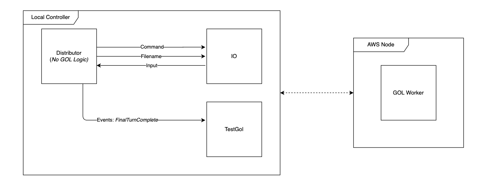

Begin by ensuring you have a working single-threaded, single-machine implementation. You should be able to test your serial code using `go test -v -run=TestGol/-1$` and all tests should pass.

Separate your implementation into two components. One component, the local controller, will be responsible for IO and capturing keypresses. The second component, the GOL Engine, will be responsible for actually processing the turns of Game of Life. You must be able to run the local controller as a client on a local machine, and the GoL engine as a server on an AWS node.

Start by implementing a basic controller which can tell the logic engine to evolve Game of Life for the number of turns specified in `gol.Params.Turns`. You can achieve this by implementing a single, blocking RPC call to process all requested turns.

Test your implementation using `go test -v -run=TestGol/-1$` *on the controller*.

### Step 2

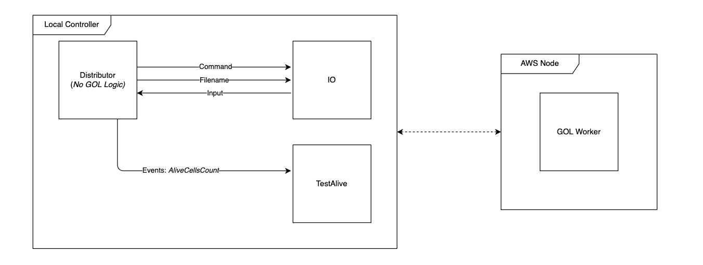

You should report the number of cells that are still alive *every 2 seconds* to the local controller. The controller should then send an `AliveCellsCount` event to the `events` channel. 

Test your implementation using `go test -v -run=TestAlive` *on the controller*.

### Step 3

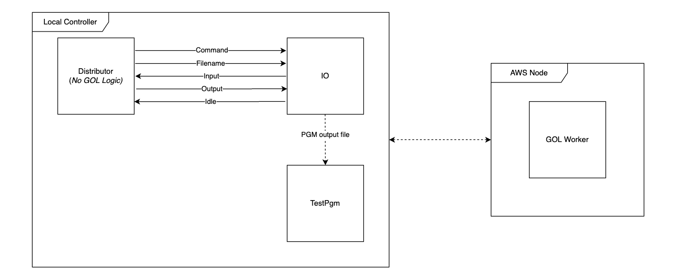

The local controller should be able to output the state of the board after all turns have completed as a PGM image. 

Test your implementation using `go test -v -run=TestPgm/-1$` *on the controller*.

### Step 4

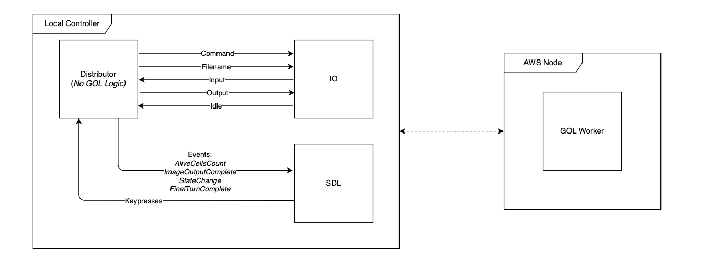

Finally, the local controller should be able to manage the behaviour of the GoL engine according to the following rules: 

- If `s` is pressed, the controller should generate a PGM file with the current state of the board.
- If `q` is pressed, close the controller client program without causing an error on the GoL server. A new controller should be able to take over interaction with the GoL engine.
- If `k` is pressed, all components of the distributed system are shut down cleanly, and the system outputs a PGM image of the latest state.
- If `p` is pressed, pause the processing *on the AWS node* and have the *controller* print the current turn that is being processed. If `p` is pressed again resume the processing and have the controller print `"Continuing"`. It is *not* necessary for `q` and `s` to work while the execution is paused.

Test the control rules by running `go run .`.

### Step 5

Split up the computation of the GoL board state (from the GoL server) across
multiple worker machines (AWS nodes).  You will need some means of distributing
work between multiple AWS machines and gathering results together in one place
while avoiding any errors in the collected board state.  Try to design your
solution so it takes advantage of the possible *scalability* of many worker
machines.

Make sure to keep the communication between nodes as efficient as possible. For example, consider a halo exchange scheme where only the edges are communicated between the nodes.

#### Largest Image

*We created a [5120x5120 pgm file](https://uob-my.sharepoint.com/:u:/g/personal/kg17815_bristol_ac_uk/EUWlZMH2MetHuNF8Ua3nb7EBx-LJqqU6OeFAW0SuHvr0pw?e=hWK1W0) if you wish to test or benchmark your solution with a very large image.*

### Success Criteria

- Pass all tests.
- Output the correct PGM images.
- Ensure the keyboard control rules work as needed.
- At minimum, the controller and the Game of Life engine should be separate
  components running on different machines (as per Step 2 above) and
communicating.
- To fully satisfy the criteria your implementation should use multiple AWS nodes efficiently.

*There is __no need__ to display the live progress of the game using SDL. However, you will still need to run a blank SDL window to register the keypresses.*

### In your report

- Discuss the system design and reasons for any decisions made. Consider using a diagram to aid your discussion.
- Explain what data is sent over the network, when, and why it is necessary.  
- Discuss how your system might scale with the addition of other distributed
  components.
- Briefly discuss your methodology for acquiring any results or measurements.
- Identify how components of your system disappearing (e.g., broken network
  connections) might affect the overall system and its results.

## Extensions

Below are suggested extensions. They vary in difficulty. There are many other possible extensions to Game of Life. If you'd like to implement something that isn't an option below you're welcome to do so, but please speak to a lecturer first.

### Halo Exchange

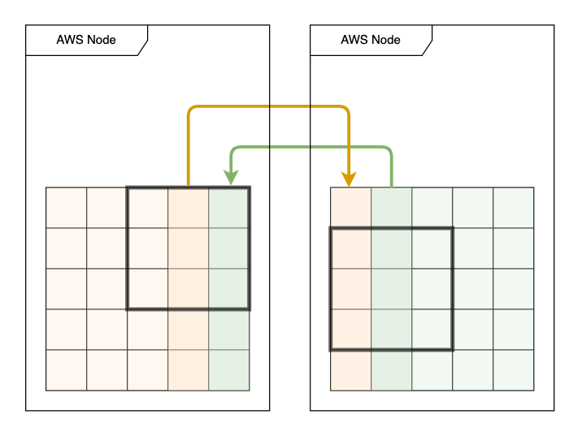

Recall that to process an iteration of Game of Life, each worker needs two extra rows (or columns). These are known as the halo regions. They need to be updated with data from neighbouring workers to process each iteration correctly. The easiest solution is to have all workers resync with a central distributor node on every iteration. This introduces a heavy communication overhead (which you might be able to measure).

Implement a Halo Exchange scheme, where workers communicate the halo regions directly to each other. Analyse the performance of your new solution and compare it with your previous implementation.

### Parallel Distributed System

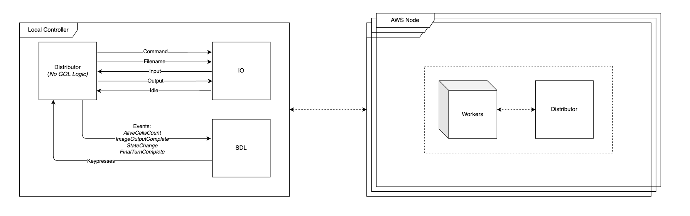

Add parallel workers within each distributed AWS Node.

Analyse the performance of your new solution and compare it with your previous implementation. Use various provided PGM images and analyse the effect on performance in context of the image size.

### SDL Live View of Distributed Implementation

Instead of showing a blank SDL window in your local controller, add support for a Live View, in a similar way to the parallel implementation. Try to keep your implementation as efficient as possible.

Analyse the performance of your new solution and compare it with your previous implementation. Quantify and explain the overhead (if any) added by the Live View.

### Fault Tolerance

Add fault tolerance to your Distributed Implementation.

In your report, explain the design of your fault tolerance mechanism. Conduct experiments to verify the effectiveness of your fault tolerance approach.

### Memory Sharing

Redesign your parallel implementation to use pure memory sharing. Replace *all* channels with traditional synchronisation mechanisms (mutexes, sempahores, condition variables). We recommend first replacing any channels used between the workers and the distributor. Then remove channels linking the distributor with the IO and with SDL. You should still keep them as seperate goroutines. Your solution must be free of deadlocks and race conditions.

Analyse the performance of your new solution and compare it with your previous implementation. Explain any differences observed.

-----------------------------------------------------------------------

## Mark Scheme

You will receive a mark out of 100 for this coursework.

### Parallel Implementation (35 marks)

20% - Single-threaded implementation.

30% - Parallel implementation implementation with the number of workers hardcoded to a non-1 value.

40% - Parallel Game of Life implementation (see Step 2). The number of threads *cannot* be hardcoded but it may be the case that only some configurations are working (e.g it's only working if the number of threads is a power of 2).

50% - Parallel Game of Life implementation, all configurations working.

Additional marks are available for satisfying further success criteria, up to:

70% - Satisfy *all* success criteria for this stage.

### Distributed Implementation (35 marks)

40% - You must be able to demonstrate a distributed Game of Life implementation. It must be running a single AWS GoL Engine Node that is controlled by a locally running controller (see Step 1).

70% - Satisfy *all* success criteria for this stage.

### Report (30 marks)

You need to submit a CONCISE (**strictly** max 6 pages) report which should cover the following topics:

Functionality and Design: Outline what functionality you have implemented, which problems you have solved with your implementations and how your program is designed to solve the problems efficiently and effectively.

Critical Analysis: Describe the experiments and analysis you carried out. Provide a selection of appropriate results. Keep a history of your implementations and provide benchmark results from various stages. Explain and analyse the benchmark results obtained. Analyse the important factors responsible for the virtues and limitations of your implementations.

Make sure your team member’s names and user names appear on page 1 of the report. **Do not include a cover page.**

## Viva

You will be required to demonstrate your implementations in a viva. This will include running tests as well as showing PGM image output and working keyboard control.

As part of the viva, we will also discuss your report. You should be prepared to discuss and expand on any points mentioned in your report.

